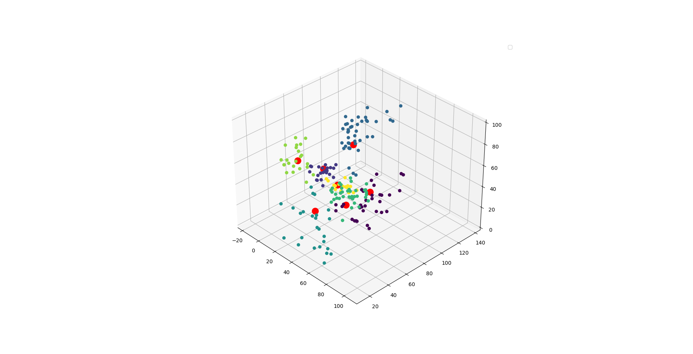
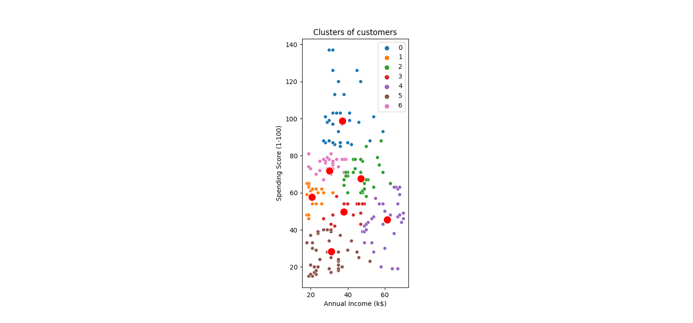
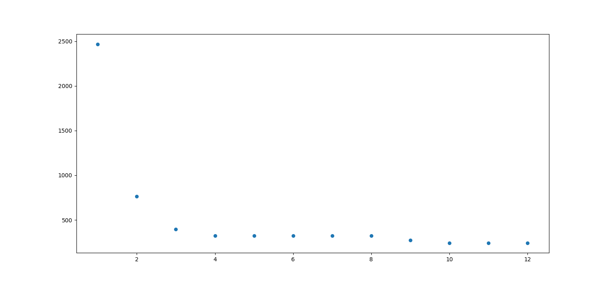

# Build and run

1. To build project run `make` - this runs `cabal build`
2. To run project with some data run `make testX` replace `X` with number (eg. `make test0`)
3. Data (clusterd data, cluster data, squared dist from centroids) is produced in `./out/`
4. To visualize data run `make vis` (this step requires python env with: pandas, seaborn and matplotlib). Visualization, obviously, works only with 2D and 3D data.

# Running in 'standalone' mode
All parameters can be provided during runtime:
```
make standalone
> cabal run
> Up to date
> File path: 
./data/gh/data.csv
> Features
> repositories, stars_count, forks_count, issues_count, pull_requests, contributors, language
> Select features 0 - 6 (eg. 1,3,5)
1,2
> Selected features: stars_count, forks_count
> Number of clusters (K): 
5
> Number of clusters (K): 5
> Seed for rand: 
42
> Number of iterations: 
100
> Dataset length: 1052x2
> Seed: 42
> Resulting sqruare distance: 6.5141816
```

# Visualization

`make test0 && make vis`

`make test0_2D && make vis`


Second image shows Elbow Method metrics
